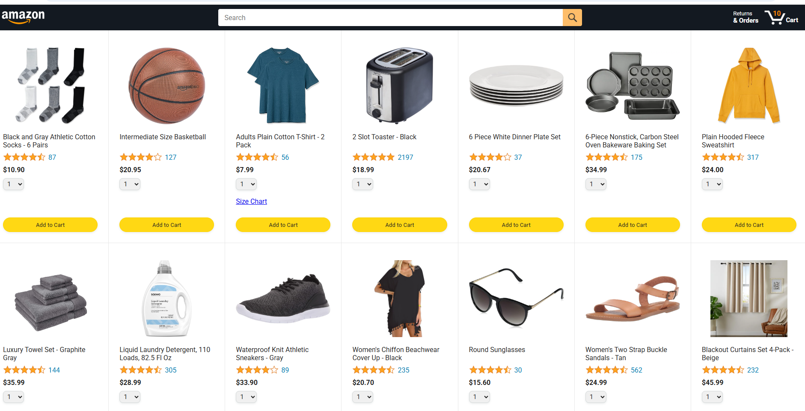

# Amazon Clone

A responsive Amazon-inspired e-commerce website built with **HTML, CSS, and JavaScript**. This project was created as a frontend practice project to improve my skills in building responsive layouts and interactive web interfaces.

## 🚀 Features

* Responsive navigation bar
* Amazon-inspired homepage layout
* Product sections and product cards
* Search interface
* Responsive design for desktop, tablet, and mobile
* Interactive elements using JavaScript

## 🛠️ Technologies Used

* HTML5
* CSS3
* JavaScript

## 📸 Preview

### Desktop View



## 🎯 Purpose

This project was built to practice frontend development concepts, including:

* Semantic HTML
* CSS layouts and responsive design
* Flexbox and Grid
* JavaScript DOM manipulation
* Creating responsive websites

## 📂 Project Structure

```text
amazon-clone/
│
├── index.html
├── style.css
├── script.js
├── desk.PNG
└── README.md
```

## 🌐 Live Demo

[View Live Demo](#)

## 📁 Repository

[View Source Code](#)

## 👨‍💻 Author

**Hamza Saeed**

Frontend Developer in progress, currently focused on improving my HTML, CSS, and JavaScript skills.

GitHub: [Code-with-Humza](https://github.com/Code-with-Humza)
